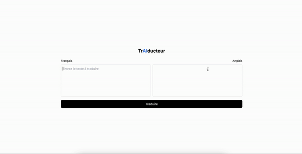
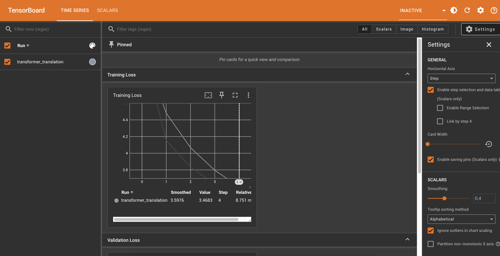

# trAIducteur
### BORDEAUX Nicolas & BRIOLON Augustin

trAIducteur is a tool that translates text from French to English. It uses Next.js for the front-end and Python for the API.

# Demo


## Compte-rendu

Entraînement de modèles de deep learning pour la traduction automatique

Dans le cadre de ce TP, nous avons exploré l'entraînement de modèles de deep learning pour traduire des phrases du français vers l'anglais. Deux architectures ont été implémentées et comparées : un modèle Seq2Seq classique et un modèle basé sur des Transformers.

## Contexte technique et limitations
L'entraînement des modèles a été significativement impacté par des contraintes matérielles :

Mac Intel : performances limitées en termes de puissance de calcul.
Mac M1 avec MPS : lors des tests sur GPU (via Metal Performance Shaders), des erreurs NaN sont apparues. Ces erreurs persistent malgré plusieurs ajustements (modifications dans les blocs d'attention, réduction du taux d'apprentissage, adaptation des fonctions Softmax, etc.). En conséquence, nous avons dû entraîner les modèles uniquement sur le CPU.
En raison de ces limitations, il n'a été possible de réaliser qu'une seule époque d'entraînement, car des entraînements plus longs seraient trop chronophages.

## Performances des modèles

### Modèle Seq2Seq :

Les résultats obtenus avec l'architecture Seq2Seq étaient peu cohérents.
Les traductions produites contenaient souvent des mots complètement aléatoires, sans lien apparent avec les phrases d'entrée. Par exemple :
Entrée : "Cinq hommes marchent dans la cuisine"
Sortie : "Walk kitchen five the of near" (mots sans structure ni sens).
Entrée : "Il y a des femmes qui marchent dans la rue"
Sortie : "Table window running the on" (erreurs similaires).
Cela montre que l'entraînement avec une seule époque n'a pas permis au modèle Seq2Seq de capturer les relations complexes nécessaires à une traduction cohérente.

### Modèle Transformers :

L'architecture Transformers s'est avérée bien plus performante en termes de cohérence linguistique et de fluidité dans les phrases produites. Toutefois, des erreurs persistent, notamment en raison du nombre limité d'époques d'entraînement.

## Analyse du screenshot TensorBoard



Le graphique de TensorBoard illustre la courbe de perte (loss) pendant l'entraînement d'un modèle :

Training Loss : La courbe montre une diminution progressive de la perte au fil des étapes. Cela indique que le modèle apprend les relations entre les phrases source et cible.
Plateau rapide : En raison de l'entraînement limité à une seule époque, la courbe ne permet pas d'observer une stabilisation complète de la perte. Avec plus de ressources, une perte potentiellement plus basse aurait pu être atteinte.
Observation : Le fait que la perte diminue rapidement montre que le modèle commence à apprendre, mais l'entraînement reste insuffisant pour capturer toutes les nuances des données de traduction.

## Conclusion
Malgré les contraintes matérielles et les limitations liées à l'entraînement sur CPU, nous avons pu constater les forces et faiblesses des deux architectures. Le modèle Seq2Seq, bien qu'efficace, montre ses limites en termes de fluidité et de cohérence sur des phrases longues ou complexes. Le modèle Transformers, quant à lui, offre de bien meilleures performances, mais nécessite davantage de ressources pour un entraînement complet.

Ce TP met en évidence l'importance des capacités matérielles dans le développement de modèles de deep learning et la nécessité d'optimiser les paramètres lorsque les ressources sont limitées

## Features

- Translate text from French to English
- User-friendly interface
- Fast and (almost) accurate translations

## Technologies Used

- **Front-end:** Next.js
- **Back-end:** Python

## Installation

1. Clone the repository:
  ```bash
  git clone https://github.com/Nicoalz/translation-mode
  ```
2. Navigate to the project directory:
  ```bash
  cd traiducteur
  ```
3. Install the dependencies for the front-end:
  ```bash
  cd frontend
  npm install
  ```
4. Install the dependencies for the back-end:
  ```bash
  cd python
  pip install -r requirements.txt
  ```

## Usage

1. Start the front-end server:
  ```bash
  cd frontend
  npm run dev
  ```
2. Start the back-end server:
  ```bash
  cd python
  uvicorn translation_api:app --reload
  ```

3. Open your browser and navigate to `http://localhost:3000` to use the application.

## Contributing

Contributions are welcome! Please open an issue or submit a pull request

## License

This project is licensed under the MIT License.